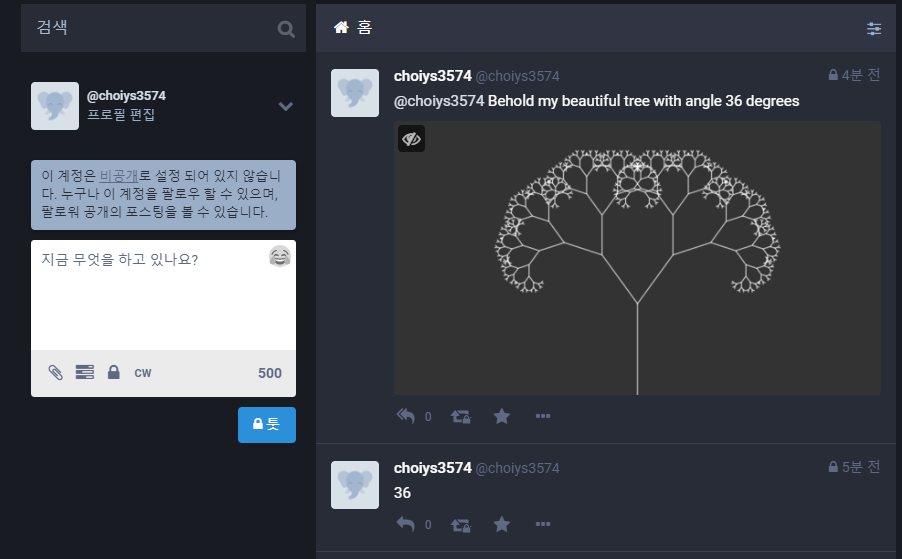
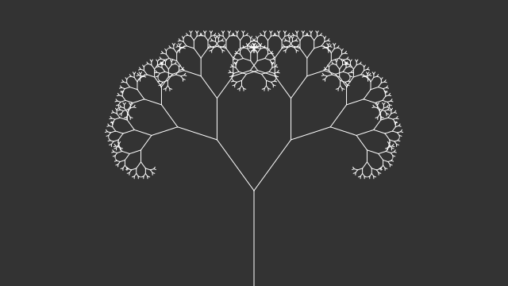

## Fractal Tree Bot with Mastodon

### Mastodon
> https://joinmastodon.org/   
> https://namu.wiki/w/%EB%A7%88%EC%8A%A4%ED%86%A0%EB%8F%88(SNS)    

 * 오픈소스 SNS 서비스의 일종.   
 * 독일 개발자 Eugen Rochko가 개발을 주도하는 오픈 소스 분산형(decentralized, 탈중앙형) SNS이다.  
 * 기본적인 사항은 트위터와 매우 유사하지만, SNS 서버를 운영하는 회사가 따로 있는게 아니라 분산형 오픈소스기 때문에 누구든 마음대로 인스턴스(서버)를 열어 운영할 수 있다.

* 마스토돈은 트위터와 달리 공식 서버나 공식 어플같은건 존재하지 않는다. 개발진은 마스토돈 서버 프로그램과 API를 공개하며 이를 지속적으로 업데이트할 뿐이고 이를 이용해 다른 유저들이 자발적으로 서버를 운영하고 어플을 만드는 식이다. 웹사이트 화면도 이 API를 사용하는 하나의 앱이다.
* 한국에서도 일부 개인 사용자에 의해 인스턴스가 운영되고 있다. 한국어 외의 국가의 인스턴스에서도 한국어 UI가 지원된다.
* 이번에 사용한 한국 인스턴스 https://twingyeo.kr/




### 사용 툴

 * p5-node
   * https://github.com/andithemudkip/p5-node
   * A Node.js implementation of the p5.js library. (using node-canvas and jsdom, along with a bunch of other modules)
 * mastodon-api
   * https://github.com/vanita5/mastodon-api
   * Node.js mastodon API client
 * dotenv
   * https://github.com/motdotla/dotenv
   * a zero-dependency module that loads environment variables from a .env file into process.env


### 시나리오

 1. 사용자가 글을 업데이트
 2. `node bot`이 업데이트 이벤트를 받아서 아래 항을 처리
    1. 댓글이 없는 글만 선택
    2. 글의 숫자를 찾아서 `angle` 변수에 저장
    3. angle 값을 인수로 `sketch.js`(p5-node)를 실행
    4. sketch.js 결과인 `tree.png`를 `mastodon media`로 업로드
    5. `mastodon`에 이미지와 함께 게시글을 작성

### bot.js
```javascript

require('dotenv').config();
const Mastodon = require('mastodon-api');
const util = require('util');
const fs = require('fs');
const exec = util.promisify(require('child_process').exec);

console.log('Fractal-Tree Bot starting...');

const M = new Mastodon({
    client_key: process.env.CLIENT_KEY,
    client_secret: process.env.CLIENT_SECRET,
    access_token: process.env.ACCESS_TOKEN,
    timeout_ms: 60 * 1000, // optional HTTP request timeout to apply to all requests.
    api_url: 'https://twingyeo.kr/api/v1/' // optional, defaults to https://mastodon.social/api/v1/
});

const cmd = 'node sketch.js';

const stream = M.stream('streaming/user');

stream.on('message', response => {
    if (response.event === 'update' && !response.data.in_reply_to_id) {
        const id = response.data.account.id;
        const acct = response.data.account.acct;
        const content = response.data.content;

        const regex = /\d+/;
        const results = content.match(regex);
        let angle = -1;
        if (results) {
            angle = results[0];
        }

        toot(acct, id, angle)
            .then(response => console.log(response))
            .catch(error => console.error(error));
    }
}); 


async function toot(acct, reply_id, angle) {
    if (angle === -1) {
        const params = {
            status: `@${acct} Please specify an angle in degrees using digits`,
            in_reply_to_id: reply_id
        };
        const response = await M.post('statuses', params);
        return {
            success: true,
            angle: -1
        };
    } else {
        // Step 1
        const response1 = await exec(cmd + ' ' + angle);
        const out = response1.stdout.split('\n');
        const stream = fs.createReadStream('tree.png');

        // Step 2: Upload Media
        const params1 = {
            file: stream,
            description: `A randomly generated fractal tree with ${angle}`
        };
        const response2 = await M.post('media', params1);
        const id = response2.data.id;

        // Step 3
        const params2 = {
            status: `@${acct} Behold my beautiful tree with angle ${angle} degrees`,
            in_reply_to_id: reply_id,
            media_ids: [id]
        };
        const response3 = await M.post('statuses', params2);
        return {
            success: true,
            angle: angle
        };
    }
}

```

### sketch.js
```javascript

const process = require('process');
const p5 = require('node-p5');

let theta;
let a = 0;

if (process.argv[2]) {
    a = Number(process.argv[2]);
    console.log('a=' + process.argv[2]);
}

function sketch(p) {
    p.setup = () => {
        const canvas = p.createCanvas(640, 360);
        p.background(51);
        p.stroke(255);
        theta = p.radians(a);
        p.translate(p.width / 2, p.height);
        p.line(0, 0, 0, -120);
        p.translate(0, -120);
        branch(p, 120);
        p.saveCanvas(canvas, 'tree', 'png').then(() => {
            console.log('saved canvas as tree.png');
        }).catch(console.error);
        p.noLoop();
    }
}

function branch(p, h) {
    // Each branch will be 2/3rds the size of the previous one
    h *= 0.66;

    // All recursive functions must have an exit condition!!!!
    // Here, ours is when the length of the branch is 2 pixels or less
    if (h > 2) {
        p.push();
        p.rotate(theta);
        p.line(0, 0, 0, -h);
        p.translate(0, -h);
        branch(p, h);
        p.pop();

        p.push();
        p.rotate(-theta);
        p.line(0, 0, 0, -h);
        p.translate(0, -h);
        branch(p, h);
        p.pop();
    }
}

let p5Instance = p5.createSketch(sketch);
```