# Chapter 10. Neural Networks

> Reference :    
> https://natureofcode.com/book/chapter-10-neural-networks/   
> https://github.com/nature-of-code/noc-examples-p5.js/tree/master/chp10_nn   

## Introduction

Some questions are here.
 * What is each object’s decision-making process? 
 * How can it adjust its chinces by learning over time?
 * Can a computational entity process its environment and generate a decision?

The human brain can be described as a biological neural network - an interconnected web of neurons transmitting elaborate patterns of electrical signals. Dendrites receive input signals and, based on those inputs, fire an output signal via an axon. Or something like that. How the human brain actually works is an elaborate and complex mystery.


We can simply be inspired by the idea of brain function. In this chapter, we'll begin with a conceptual overview of the properties and features of neural networks and build the simplest possible example of one (a network that consists of a single neuron). Afterwards, we'll examine strategies for creating a `Brain` object that can be inserted into `Vehicle` class and used to determine steering. Finally, we'll also look at techniques for visualizing and animating a network of neurons.

---

## 10.1 Artificial Neural Networks: Introduction and Application

Computer scientists have long been inspired by the human brain. In 1943, Warren S. McCulloch, a neuroscientist, and Walter Pitts, a logician, developed the first conceptual model of an artificial neural network. In their paper, "A logical calculus of the ideas imminent in nervous activity,” they describe the concept of a `neuron`, a __single cell living in a network of cells__ that `receives inputs`, `processes those inputs`, and `generates an output`.   

Their work, and the work of many scientists and researchers that followed, was not meant to accurately describe how the biological brain works. Rather, an artificial neural network was designed as `a computational model based on the brain` to solve certain kinds of problems.

There are problems that are incredibly simple for a computer to solve, but difficult for humans like taking the square root of 964,324. On the other hand, there are problems that are incredibly simple for humans to solve, but not for a computer. But need a machine to perform these tasks? Scientists have already spent entire careers researching and implementing complex solutions.

The most common application of neural networks in computing today is to perform one of these “easy-for-a-human, difficult-for-a-machine” tasks, often referred to as pattern recognition. Applications range from optical character recognition to facial recognition. 

A neural network is a “connectionist” computational system. The computational systems we write are procedural, but a true neural network does not follow a linear path. Rather, information is processed collectively, in parallel throughout a network of nodes (in these case, the nodes being neurons). The individual elements of the network, the neurons, are simple. They read an input, process it, and generate an output. A network of many neurons, however, can exhibit incredibly rich and intelligent behaviors.


One of the key elements of a neural network is its ability to *learn*. A neural network is not just a complex system, but a complex __adaptive__ system, meaning it can change its internal structure based on the information flowing through it. Typically, this is achieved through the adjusting of weights.  In the diagram above, each line represents a connection between two neurons and indicates the pathway for the flow of information. Each connection has a __weight__, `a number that controls the signal between the two neurons`. If the network generates a “good” output, there is no need to adjust the weights. However, if the network generates a “poor” output — an error, so to speak — then the system adapts, altering the weights in order to improve subsequent results.

There are several strategies for learning.
 * `Supervised Learning` - A strategy that involves a teacher that is smarter than the network itself. The network can then compare its answers to the known “correct” ones and make adjustments according to its errors.
 * `Unsupervised Learning` - Required when there isn’t an example data set with known answers. Imagine searching for a hidden pattern in a data set. An application of this is clustering, i.e. dividing a set of elements into groups according to some unknown pattern.
 * `Reinforcement Learning` - A strategy built on observation. If the observation is negative, the network can adjust its weights in order to make a different decision the next time. Reinforcement learning is common in robotics. At time t, the robot performs a task and observes the results. 

Here are some standard uses of neural networks in software today.
 * `Pattern Recognition` — It’s probably the most common application. Examples are facial recognition, optical character recognition, etc.
 * `Time Series Prediction` - Neural networks can be used to make predictions. Will the stock rise or fall tomorrow? Will it rain or be sunny?
 * `Signal Processing` - Neural networks can be trained to process an audio signal and filter it appropriately.
 * `Control` - Neural networks are often used to manage steering decisions of physical vehicles (or simulated ones).
 * `Soft Sensors` - A soft sensor refers to the process of analyzing a collection of many measurements. A thermometer can tell you the temperature of the air, but what if you also knew the humidity, barometric pressure, dewpoint, air quality, air density, etc.? Neural networks can be employed to process the input data from many individual sensors and evaluate them as a whole.
 * `Anomaly Detection` - Because neural networks are so good at recognizing patterns, they can also be trained to generate an output when something occurs that doesn’t fit the pattern. Think of a neural network monitoring your daily routine over a long period of time. After learning the patterns of your behavior, it could alert you when something is amiss.


## 10.2 The Perceptron

Invented in 1957 by Frank Rosenblatt at the Cornell Aeronautical Laboratory, a __perceptron__ is the simplest neural network possible: `a computational model of a single neuron`. A perceptron consists of one or more inputs, a processor, and a single output. 

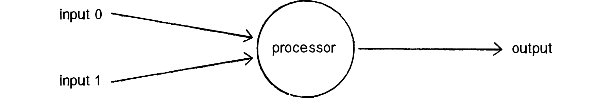

A perceptron follows the “feed-forward” model, meaning inputs are sent into the neuron, are processed, and result in an output. In the diagram above, this means the network (one neuron) reads from left to right: inputs come in, output goes out.

Let's follow each of these steps in more detail.

 * Step 1: Receive inputs.  
    ```
    Input 0: x1 = 12
    Input 1: x2 = 4
    ```
 * Step 2: Weight inputs.  
    Each input that is sent into the neuron must first be weighted. When creating a perceptron, we’ll typically begin by assigning random weights. 
    ```
    Weight 0: 0.5
    Weight 1: -1

    Input 0 * Weight 0 ⇒ 12 * 0.5 = 6
    Input 1 * Weight 1 ⇒ 4 * -1 = -4
    ```
 * Step 3: Sum inputs.   
    ```
    Sum = 6 + -4 = 2
    ```
 * Step 4: Generate output.  
    The output of a perceptron is generated by passing that sum through an `activation function`. In the case of a simple binary output, the activation function is what tells the perceptron whether to “fire” or not.  
    Let’s make the activation function the sign of the sum. In other words, if the sum is a positive number, the output is 1; if it is negative, the output is -1.
    ```
    activation function : sign()

    Output = sign(sum) ⇒ sign(2) ⇒ +1
    ```

Summary of the percepton algorithm:
 1.  For every input, multiply that input by its weight.
 2.  Sum all of the weighted inputs.
 3.  Compute the output of the perceptron based on that sum passed through an activation function.

```typescript

const inputs = [ 12, 4 ];
const weights = [ 0.5, -1 ];
const activationFunction = (value: number) => value > 0 ? 1 : -1;
const perceptron = new Perceptron(weights, activationFunction);

const output = perceptron.process(inputs);

class Perceptron {

    private weights: number[];
    private activationFunction: number => number;

    constructor(weights: number[], activationFunction: number => number) {
        this.weights = weights;
        this.activationFunction = activationFunction;
    }

    public process(inputs: number[]): number {    // receive inputs
        if (inputs.length !== this.weight.length) {
            throw new Error('dimension not matches.');
        }
        let sum = 0;
        for (let i = 0; i < inputs.length; i++) {
            sum += inputs[i] * this.weights[i];  // weight input & sum input
        }
        return this.activationFunction(sum);     // apply activation function and generate output
    }

}

```

--- 

## 10.3 Simple Pattern Recognition Using a Perceptron

Now that we understand the computational process of a perceptron, we can look at an example of one in action. Even simple perceptrons can demonstrate the basics of classification, as in the following example.

Consider a line in two-dimensional space. Points in that space can be classified as living on either one side of the line or the other. This example shows how a perceptron can be trained to recognize points on one side versus another.

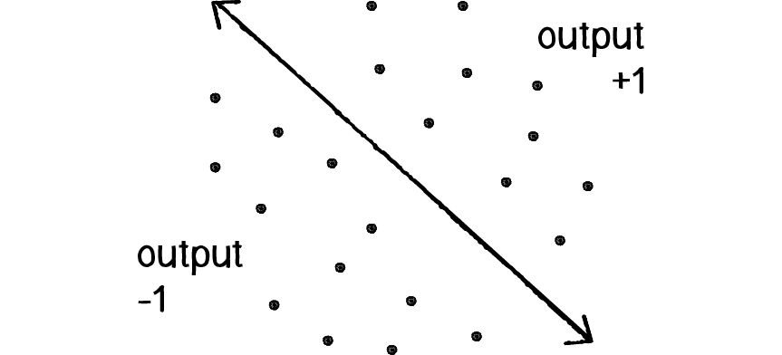

Let’s say a perceptron has 2 inputs (the x- and y-coordinates of a point). Using a sign activation function, the output will either be -1 or 1 — i.e., the input data is classified according to the sign of the output. In the above diagram, we can see how each point is either below the line (-1) or above (+1).

The perceptron itself can be diagrammed as follows:
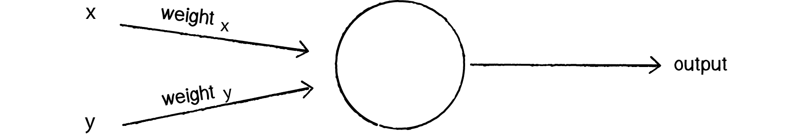

We can see how there are two inputs (x and y), a weight for each input (weight_x and weight_y), as well as a processing neuron that generates the output.

There is a pretty significant problem here, however. Let’s consider the point (0,0). What if we send this point into the perceptron as its input: x = 0 and y = 0? What will the sum of its weighted inputs be? No matter what the weights are, the sum will always be 0! But this can’t be right — after all, the point (0,0) could certainly be above or below various lines in our two-dimensional world.

`To avoid this dilemma, our perceptron will require a third input, typically referred to as a bias input`. `A bias input always has the value of 1 and is also weighted`. Here is our perceptron with the addition of the bias:
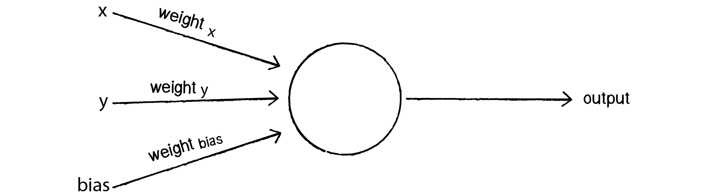 

Let’s go back to the point (0,0). Here are our inputs:
```
0 * weight for x = 0
0 * weight for y = 0
1 * weight for bias = weight for bias
```

The output is the sum of the above `three values`, 0 plus 0 plus the `bias’s weight`. Therefore, the bias, on its own, answers the question as to where (0,0) is in relation to the line. If the bias’s weight is positive, (0,0) is above the line; negative, it is below. It “biases” the perceptron’s understanding of the line’s position relative to (0,0).

---

## 10.4 Coding the Perceptron

A perceptron needs to be able to receive inputs and generate an output. We can package these requirements into a function called feedforward(). In this example, we’ll have the perceptron receive its inputs as an array (which should be the same length as the array of weights) and return the output as an integer.

Presumably, we could now create a `Perceptron` object and ask it to `make a guess` for any given point.

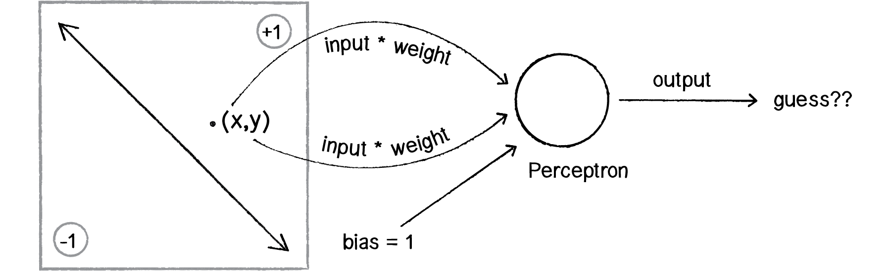 

```typescript

class Perceptron {

    private weights: number[];
    private bias: number;

    constructor(n: number) {
        this.weights = new Array(n).fill(0).map(v => Math.random(-1, 1));
        this.bias = Math.random(-1, 1);
    }

    public feedForward(inputs: number[]): number {
        if (inputs.length !== this.weights.length + 1) {
            throw new Error('dimension not matches.');
        }
        let sum = 0;
        for (let i = 0; i < inputs.length; i++) {
            sum += inputs[i] * this.weights[i];  // weight input & sum input
        }
        return activate(sum + this.bias);     // apply activation function and generate output
    }

    private activate(value): float {    // receive inputs
        return value > 0 ? 1 : -1;
    }

}

const perceptron = new Perceptron(5);
const pointCoord = [ 12, 4 ];
const result = perceptron.feedForward(pointCoord);

```

Did the perceptron get it right? At this point, the perceptron has no better than a 50/50 chance of arriving at the right answer. Remember, when we created it, we gave each weight a random value. A neural network isn’t magic. It’s not going to be able to guess anything correctly unless we teach it how to! 

To train a neural network to answer correctly, we’re going to employ the method of supervised learning that we described in [section 10.1](#101-artificial-neural-networks-introduction-and-application).

With this method, the network is provided with inputs for which there is a known answer. This way the network can find out if it has made a correct guess. If it’s incorrect, `the network can learn from its mistake and adjust its weights`. The process is as follows:
 1. Provide the perceptron with inputs for which there is a known answer.
 2. Ask the perceptron to guess an answer.
 3. Compute the error. (Did it get the answer right or wrong?)
 4. Adjust all the weights according to the error.
 5. Return to Step 1 and repeat!

Steps 1 through 4 can be packaged into a function. Before we can write the entire function, however, we need to examine Steps 3 and 4 in more detail. How do we `define the perceptron’s error`? And how should we `adjust the weights according to this error`?

The perceptron’s error can be defined as the difference between the desired answer and its guess.
```
    ERROR = DESIRED OUTPUT - GUESS OUTPUT
```
In the case of the perceptron, the output has only two possible values: +1 or -1. This means there are only three possible errors. If the perceptron guesses the correct answer, then the guess equals the desired output and the error is 0. If the correct answer is -1 and we’ve guessed +1, then the error is -2. If the correct answer is +1 and we’ve guessed -1, then the error is +2.  

|  Desired  | Guess | Error |
| ---       | ---   | ---   |
| -1        | -1    |  0    |
| -1        | +1    | -2    |
| +1        | -1    | +2    |
| +1        | +1    |  0    |

The error is the determining factor in how the perceptron’s weights should be adjusted. For any given weight, what we are looking to calculate is the change in weight, often called Δweight (or “delta” weight, delta being the Greek letter Δ). Δweight is calculated as the error multiplied by the input.

```
    NEW WEIGHT = WEIGHT + ΔWEIGHT
    ΔWEIGHT = ERROR * INPUT

    Therefore,
    NEW WEIGHT = WEIGHT + ERROR * INPUT
```

To understand why this works, we can again return to steering. `A steering force is essentially an error in velocity`. If we apply that force as our acceleration (Δvelocity), then we adjust our velocity to move in the correct direction. This is what we want to do with our neural network’s weights. We want to adjust them in the right direction, as defined by the error. 

With steering, however, we had an `additional variable that controlled the vehicle’s ability to steer: the maximum force`. With a high maximum force, the vehicle was able to accelerate and turn very quickly; with a lower force, the vehicle would take longer to adjust its velocity.  The neural network will employ a similar strategy with a variable called the “learning constant.” We’ll add in the learning constant as follows:  
```
    NEW WEIGHT = WEIGHT + ERROR * INPUT * LEARNING CONSTANT
```

Notice that a high learning constant means the weight will change more drastically. This may help us arrive at a solution more quickly, but with such large changes in weight it’s possible we will overshoot the optimal weights. With a small learning constant, the weights will be adjusted slowly, requiring more training time but allowing the network to make very small adjustments that could improve the network’s overall accuracy. 

Assuming the addition of a variable *learningRate* for the learning constant, we can now write a `training function` for the perceptron following the above steps.


```typescript

class Perceptron {

    private weights: number[];
    private bias: number;
    private learningRate: number = 0.01;

    constructor(n: number) {
        this.weights = new Array(n).fill(0).map(v => Math.random(-1, 1));
        this.bias = Math.random(-1, 1);
    }

    public feedForward(inputs: number[]): number {
        if (inputs.length !== this.weights.length) {
            throw new Error('dimension not matches.');
        }
        let sum = 0;
        for (let i = 0; i < inputs.length; i++) {
            sum += inputs[i] * this.weights[i];  // weight input & sum input
        }
        return activate(sum + this.bias);     // apply activation function and generate output
    }

    private activate(value): float {    // receive inputs
        return value > 0 ? 1 : -1;
    }

    public setLearningConstant(value: number) {
        this.learningRate = value;
    }

    public train(inputs: number[], desired: number) {
        const guess = this.feedForward(inputs);
        const error = desired - guess;
        for (let i = 0; i < this.weights.length; i++) {
            this.weights[i] += this.learningRate * error * inputs[i];
        }
        this.bias += this.learningRate * error;
    }

}


const perceptron = new Perceptron(5);
const pointCoord = [ 12, 4 ];
const result = perceptron.feedForward(pointCoord);

```

To train the perceptron, we need a set of inputs with a known answer. We could package this up in a class like so:

```typescript
class Trainer {

    private input: number[];
    private answer: number;

    constructor(x: number, y: number, answer: number) {
        this.inputs = [x, y];
        this.answer = answer;
    }

    public getInput(): number[] {
        return this.input;
    }

    public getAnswer(): number {
        return this.answer;
    }
    
}
```

Now the question becomes, how do we pick a point and know whether it is above or below a line? Let’s start with the formula for a line, where y is calculated as a function of x:

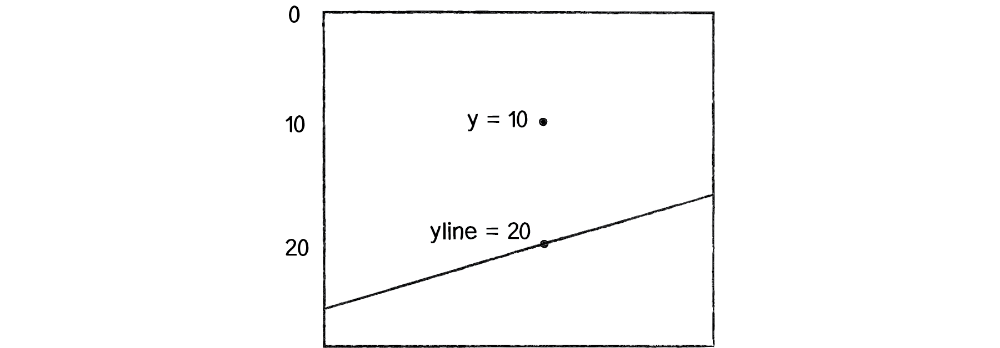 

```typescript
// y = f(x),

// In generic terms, a line can be described as:
//    y = ax + b
// In this case, 
//    let y = 2 * x + 1

// a function to calculate y based on x along a line
const f = (x: number) => 2 * x + 1;

const width = 400;
const height = 400;

const x = Math.random(width);
const y = Math.random(height);
const yline = f(x); // the y position on the line

const answer = (y < yline) ? -1 : 1;
const trainer = new Trainer(x, y, answer);

perceptron.train(t.getInput(), t.getAnswer());

```

Now, it’s important to remember that this is just a demonstration. We don’t need a perceptron to tell us whether a point is above or below a line; we can do that with simple math. We are using this scenario, one that we can easily solve without a perceptron, to demonstrate the perceptron’s algorithm as well as easily confirm that it is working properly.


### DEMO

Let’s look at how the perceptron works with an array of many training points. Use p5.js to visualize this example.

[Example 10.1: The Perceptron Demo](./10_1/index.html)  
[Example 10.1: The Perceptron Code](./10_1/sketch.js)


---


## 10.5 A Steering Perceptron

 In this section, we’ll take the concepts of a perceptron (array of inputs, single output), apply it to `steering behaviors`, and `demonstrate reinforcement learning` along the way.

 Here’s our scenario. Let’s say we have a p5.js sketch with an ArrayList of targets and a single vehicle.  

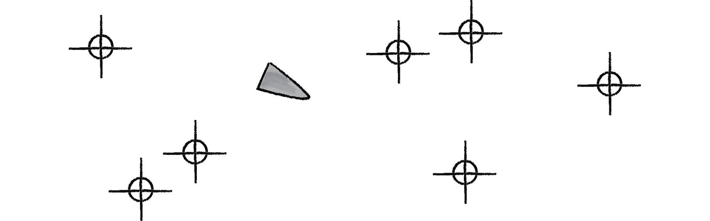 

Let’s say that the `vehicle` seeks all of the targets. We would write a function that calculates a steering force towards each target, applying each force one at a time to the object’s acceleration. 

Assuming the targets are an list of p5.Vector objects, it would look something like:

 ```typescript

class Vehicle {

    private brain: Perceptron;

    private position: p5.Vector;
    private velocity: p5.Vector;
    private acceleration: p5.Vector;

    steer(targetPositions: p5.Vector[]) {
        for (const targetPos of targetPositions) {
            const force = this.seek(targetPos);   
            this.applyForce(force);
        }
    }

    seek(targetPos: p5.Vector) {
        const desired = p5.Vector.sub(targetPos, this.position);
        desired.normalize();
        // desired.mult(this.maxSpeed);
        // we could say that the farther you are from a target, the stronger the force.
        const d = dist(targetPos.x, targetPos.y, this.position.x, this.position.y);
        desired.mult(d);
        const steer = p5.Vector.sub(desired, this.velocity);
        steer.limit(this.maxForce);
        return steer;
    }

    applyForce(force) {
        this.acceleration.add(force);
    }

}
 ```

We could say that the farther you are from a target, the stronger the force. But what if instead we could ask our brain (i.e. perceptron) to take in all the forces as an input, process them according to weights of the perceptron inputs, and generate an output steering force? What if we could instead say:

```typescript

steer(targetPositions: p5.Vector[]) {
    const forces = [];
    for (const targetPos of targetPositions) {
        forces.push(this.seek(targetPos));   
    }
    const output = brain.feedForward(forces)
    this.applyForce(output);
}

```

In other words, instead of weighting and accumulating the forces inside our vehicle, we simply pass an array of forces to the vehicle’s “brain” object and allow the brain to weight and sum the forces for us.

The output is then applied as a steering force. This opens up a range of possibilities. A vehicle could make decisions as to how to steer on its own, learning from its mistakes and responding to stimuli in its environment. Let’s see how this works.

We can use the line classification perceptron as a model, with one important difference — the inputs are not single numbers, but vectors! Let’s look at how the `feedForward()` function works in our vehicle’s perceptron, alongside the one from our previous example.

```typescript

// Line number inputs
feedForward(inputs: number[]): number {
    if (inputs.length !== this.weights.length) {
        throw new Error('dimension not matches.');
    }
    let sum = 0;
    for (let i = 0; i < inputs.length; i++) {
        sum += inputs[ i ] * this.weights[ i ];  // weight input & sum input
    }
    return this.activate(sum + this.biasWeight); // apply activation function and generate output
}

// Vehicle p5.Vector inputs
feedForward(inputs: p5.Vector[]): p5.Vector {
    if (inputs.length !== this.weights.length) {
        throw new Error('dimension not matches.');
    }
    const sum = new p5.Vector();
    for (let i = 0; i < inputs.length; i++) {
        inputs[i].mult(weights[i]);
        sum.add(inputs[i]);
    }
    // return this.activate(sum + this.biasWeight); 
    sum.x += this.biasWeight;
    sum.y += this.biasWeight;
    return sum;  // no activation function
}

```

Note how these two functions implement nearly identical algorithms, with two differences:
 1. `Summing Vectors.` Instead of a series of numbers added together, each input is a p5.Vector and must be multiplied by the weight and added to a sum according to the mathematical p5.Vector functions.
 2. `No activation function.` In this case, we’re taking the result and applying it directly as a steering force for the vehicle, so we’re not asking for a simple boolean value that classifies it in one of two categories. Rather, we’re asking for raw output itself, the resulting overall force.

Once the resulting steering force has been applied, it’s time to give feedback to the brain, i.e. reinforcement learning. Was the decision to steer in that particular direction a good one or a bad one?  

Let’s take a simpler example, where the vehicle simply wants to stay close to the center of the window. We’ll train the brain as follows:  

```typescript
const desired: p5.Vector = new p5.Vector(width / 2, height / 2);
const error: p5.Vector = p5.Vector.sub(desired, this.position);
this.brain.train(forces, error);
```

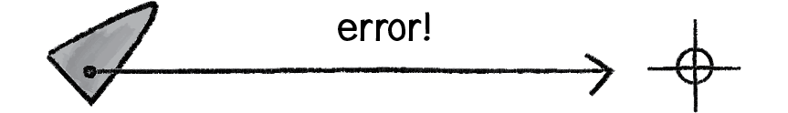 

Here we are passing the brain a copy of all the inputs (which it will need for error correction) as well as an observation about its environment: a p5.Vector that points from its current location to where it desires to be. This p5.Vector essentially serves as the error — the longer the p5.Vector, the worse the vehicle is performing; the shorter, the better.

```typescript

// Training the Line Classifier
void train(inputs: number[], desired: number): void {
    const guess: number = this.feedForward(inputs);
    const error: number = desired - guess;

    for (let i = 0; i < this.weights.length; i++) {
        this.weights[i] += this.learningRate * error * inputs[i];
    }
    this.bias += this.learningRate * error
}

// Training the Vehicle
void train(forces: p5.Vector[], error: p5.Vector): void {
    for (let i = 0; i < this.weights.length; i++) {
        this.weights[i] += this.learningRate * error.x * forces[i].x;
        this.weights[i] += this.learningRate * error.x * forces[i].y;
    }
    this.bias += this.learningRate * error.x;
    this.bias += this.learningRate * error.y;
}
```

Because the vehicle observes its own error, there is no need to calculate one; we can simply receive the error as an argument. `Notice how the change in weight is processed twice, once for the error along the x-axis and once for the y-axis`.

We can now look at the Vehicle class and see how the steer function uses a perceptron to control the overall steering force. 

```javascript 

class Vehicle {

    constructor(x, y, n) {
        this.position = createVector(x, y);
        this.velocity = createVector(0, 0);
        this.acceleration = createVector(0, 0);
        this.brain = new Perceptron(n, 0.001);

        this.r = 3.0;
        this.maxSpeed = 4;
        this.maxForce = 0.1;
    }

    update() {
        this.velocity.add(this.acceleration);
        this.velocity.limit(this.maxSpeed);
        this.position.add(this.velocity);
        this.acceleration.mult(0);

        this.position.x = constrain(this.position.x, 0, width);
        this.position.y = constrain(this.position.y, 0, height);
    }

    applyForce(force) {
        this.acceleration.add(force);
    }

    // a method that calculates a steering force towards a target
    // Steering force = desired velocity - this velocity
    seek(target) {
        // desired = a vector pointing from the position to the target.
        const desired = p5.Vector.sub(target, this.position);
        desired.normalize();
        desired.mult(this.maxSpeed);
        const steer = p5.Vector.sub(desired, this.velocity);
        steer.limit(this.maxForce);

        return steer;
    }

    steer(targets) {
        const forces = targets.map(target => this.seek(target));
        const result = this.brain.feedForward(forces);
        this.applyForce(result);

        const desiredPos = createVector(width / 2, height / 2);
        const error = p5.Vector.sub(desiredPos, this.position);
        this.brain.train(forces, error);
    }

}

class Perceptron {

    constructor(n, learningRate) {
        this.weights = new Array(n).fill(0).map(v => random(-1, 1));
        this.biasWeight = random(-1, 1);
        this.learningRate = learningRate;
    }

    feedForward(forces) {
        if (forces.length !== this.weights.length) {
            throw new Error('dimension not matches.');
        }
        const sum = createVector(0, 0);
        for (let i = 0; i < forces.length; i++) {
            sum.add(forces[i].copy().mult(this.weights[i]));
        }
        return sum.add(this.biasWeight, this.biasWeight);
    }

    train(forces, error) {
        for (let i = 0; i < this.weights.length; i++) {
            this.weights[ i ] += this.learningRate * error.x * forces[ i ].x;
            this.weights[ i ] += this.learningRate * error.y * forces[ i ].y;
        }
        this.biasWeight += this.learningRate * error.x;
        this.biasWeight += this.learningRate * error.y;
    }
}

```

### DEMO

[Example 10.2: The Perceptron Steering Demo](./10_2/index.html)   
[Example 10.2: The Perceptron Steering Code - perceptron.js](./10_2/perceptron.js)   
[Example 10.2: The Perceptron Steering Code - vehicle.js](./10_2/vehicle.js)   
[Example 10.2: The Perceptron Steering Code - sketch.js](./10_2/sketch.js)   


---

## 10.6 It's a "Network", Remember?

Yes, a perceptron can have multiple inputs, but it is still a lonely neuron. The power of neural networks comes in the networking itself. Perceptrons are, sadly, incredibly limited in their abilities. `A perceptron can only solve linearly separable problems`. What’s a linearly separable problem? Let’s take a look at our first example, which determined whether points were on one side of a line or the other.

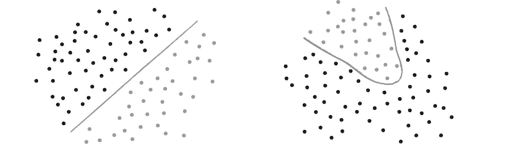

On the left of Figure above, we have classic linearly separable data. Graph all of the possibilities; if you can classify the data with a straight line, then it is linearly separable. On the right, however, is non-linearly separable data. You can’t draw a straight line to separate the black dots from the gray ones.

One of the simplest examples of a non-linearly separable problem is `XOR`, or “exclusive or.” We’re all familiar with AND. For A AND B to be true, both A and B must be true. With OR, either A or B can be true for A OR B to evaluate as true. These are both linearly separable problems. Let’s look at the solution space, a “truth table.”


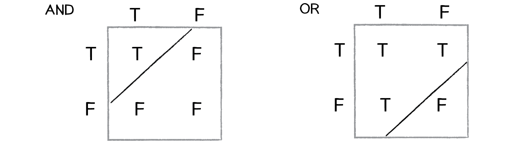

XOR is the equivalent of OR and NOT AND. In other words, A XOR B only evaluates to true if one of them is true. If both are false or both are true, then we get false. Take a look at the following truth table.

```
   Input0, Input1 ->

   Output = AND( NAND(Input0, Input1), OR(Input0, Input1) )

```


This is not linearly separable. Try to draw a straight line to separate the true outputs from the false ones — you can’t!

`So perceptrons can’t even solve something as simple as XOR`. But `what if we made a network out of two perceptrons`? If one perceptron can solve OR and one perceptron can solve NOT AND, then two perceptrons combined can solve XOR. 

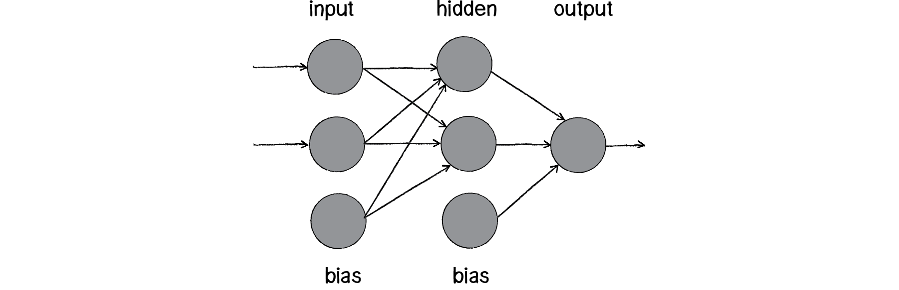

The above diagram is known as a `multi-layered perceptron`, a network of many neurons. Some are input neurons and receive the inputs, some are part of what’s called a `“hidden” layer` (as they are connected to neither the inputs nor the outputs of the network directly), and then there are the output neurons, from which we read the results.

__Training these networks__ is much more complicated. With the simple perceptron, we could easily evaluate how to change the weights according to the error. But here there are so many different connections, each in a different layer of the network. How does one know how much each neuron or connection contributed to the overall error of the network?

The solution to optimizing weights of a multi-layered network is known as `backpropagation`. The output of the network is generated in the same manner as a perceptron. The inputs multiplied by the weights are summed and fed forward through the network. `The difference here is that they pass through additional layers of neurons before reaching the output.` Training the network (i.e. adjusting the weights) also involves taking the error (desired result - guess). `The error, however, must be fed backwards through the network.` *The final error ultimately adjusts the weights of all the connections.*

Backpropagation is a bit beyond the scope of this book and involves a fancier activation function (called the sigmoid function) as well as some basic calculus. If you are interested in how backpropagation works, check for examples below that solves XOR using a multi-layered feed forward network with backpropagation.

### DEMO

[Example 1: XOR problem using Toy Neural Network](https://yooseongc.github.io/coding-train/coding-challenge/092_xor_problem/)  
[Example 2: XOR problem using TensorFlow.js](https://yooseongc.github.io/coding-train/coding-challenge/106_xor_problem_with_tensorflow.js/)

Instead, here we’ll focus on a code framework for building the visual architecture of a network. We’ll make Neuron objects and Connection objects from which a Network object can be created and animated to show the feed forward process.  


---

## 10.7 Neural Network Diagrams

Our goal will be to create the following simple network diagram:

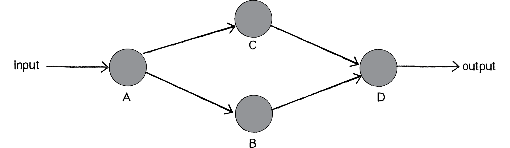

The primary building block for this diagram is a `neuron`. For the purpose of this example, the Neuron class describes an entity with an (x,y) location.

```javascript

class Neuron {

    constructor(x, y) {
        this.position = createVector(x, y);
        this.connections = [];
    }

    addConnection(connection) {
        this.connections.push(connection);
    }

    show() {
        stroke(0);
        strokeWeight(1);
        fill(0);
        ellipse(this.position.x, this.position.y, 16);

        for (const connection of this.connections) {
            connection.show();
        }
    }

}

```

The `Network` class can then manage an list of neurons, as well as have its own location (so that `each neuron is drawn relative to the network’s center`). This is particle systems 101. We have a single element (a neuron) and a network (a “system” of many neurons).

```javascript

class Network {

    constructor(centerX, centerY) {
        this.center = createVector(centerX, centerY);
        this.neurons = [];
    }

    addNeuron(neuron) {
        this.neurons.push(neuron);
    }

    connect(a, b) {
        const connection = new Connection(a, b, random(1)); // random weight
        a.addConnection(connection);
    }

    show() {
        push();
        translate(this.center.x, this.center.y);
        for (const neuron of this.neurons) {
            neuron.show();
        }
        pop();
    }
}

```

We can consider a `Connection` object to be made up of three elements, two neurons (from Neuron a to Neuron b) and a weight.

```javascript
class Connection {

    constructor(from, to, weight) {
        this.a = from;
        this.b = to;
        this.w = weight;
    }

    show() {
        stroke(0);
        strokeWeight(this.weight * 4);
        line(this.a.position.x, this.a.position.y, this.b.position.x, this.b.position.y);
    }

}
```

```javascript

let network;

function setup() {
    createCanvas(640, 360);
    network = new Network(width / 2, height /2);

    // two inputs
    const x0 = new Neuron(-200, -75);
    const x1 = new Neuron(-200, 75);

    // two hiddens
    const h0 = new Neuron(0, -75);
    const h1 = new Neuron(0, 75);

    // one output
    const y = new Neuron(200, 0);

    // add vertices
    network.addNeuron(x0);
    network.addNeuron(x1);
    network.addNeuron(h0);
    network.addNeuron(h1);
    network.addNeuron(y);

    // add edges
    network.connect(x0, h0);
    network.connect(x0, h1);
    network.connect(x1, h0);
    network.connect(x1, h1);
    network.connect(h0, y);
    network.connect(h1, y);

}

function draw() {
    background(200);
    network.show();
    noLoop();
}

```

### DEMO

[Example 10.3: The Network Visualization](10_3/index.html)


---

## 10.8 Animating Feed Forward

An interesting problem to consider is `how to visualize the flow of information` as it travels throughout a neural network. Our network is built on the feed forward model, meaning that an input arrives at the first neuron (drawn on the lefthand side of the window) and the output of that neuron flows across the connections to the right until it exits as output from the network itself.

Our first step is to add a function to the network to receive this input, which we’ll make a random number between 0 and 1.  


```javascript

// sketch.js
function setup() {
    ...
    network.feedForward(random(1));
    ...
}

// network.js
class Network {
    ...
    feedForward(input) {
        const start = this.neurons[0];
        start.feedForward(input);
    }
    ...
}

// neuron.js
class Neuron {
    ...
    feedForward(input) {
        this.sum += input;
        if (this.sum > 1) {
            this.fire();
            this.sum = 0;
        }
    }
    ...
    fire() {
        for (const connection of this.connections) {
            connection.feedForward(this.sum);
        }
    }
    ...
}

// connection.js
class Connection {
    ...
    feedForward(value) {
        this.b.feedForward(value * this.weight);
    }
}

```


But this is not what we want. What we want to do is *draw something that we can see traveling along the connection from Neuron a to Neuron b*. 

Let’s first think about how we might do that. We know the location of Neuron a; it’s the p5.Vector a.position. Neuron b is located at b.position. We need to start something moving from Neuron a by `creating another P5.Vector that will store the path of our traveling data`.

```javascript
// connection.js modified
class Connection {

    constructor(from, to, weight) {
        this.a = from;
        this.b = to;
        this.w = weight;
        this.sending = false;  // sending state
        this.sender = null;    // sender position vector
        this.output = null;
    }

    ...
    feedForward(value) {
        this.sending = true;                  // sending is now true.
        this.sender = this.a.position.copy(); // start the animation at the location of Neuron A
        this.output = value * this.weight;    // store the output for when it is actually time to feed it forward.
    }
    ...
    update() {
        if (this.sending) {
            // move 10% per frame
            this.sender.x = lerp(this.sender.x, this.b.position.x, 0.1);
            this.sender.y = lerp(this.sender.y, this.b.position.y, 0.1);

            const d = dist(this.sender, this.b.position);
            if (d < 1) {  // if close enough, turn off sending
                this.b.feedForward(this.output);
                this.sending = false;
            }

        }
    }

}

```

```javascript
// sketch.js modified
...
function draw() {
    ...
    network.show();
    network.update();

    if (frameCount % 30 === 0) {
        network.feedForward();
    }
}
...

// network.js modified
...
update() {
    for (const connection of this.connections) {
        connection.update();
    }
}
...
```

### DEMO

[Example 10.4: The Network Animation](10_4/index.html)


