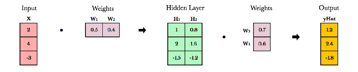
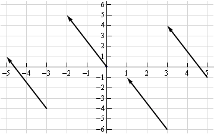
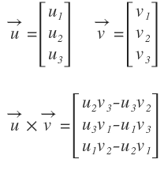
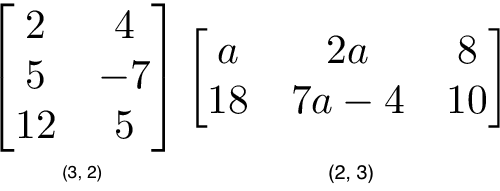
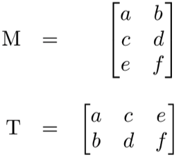
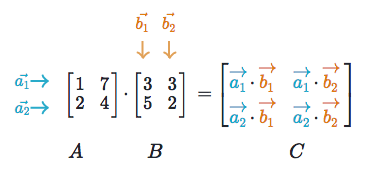
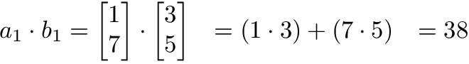

# Matrix Math

## Table of Contents

 1. [Linear Algebra for Deep Learning](#linear-algebra-for-deep-learning)
 2. [Implementation using Javascript](#implementation-using-javascript)


## Linear Algebra for Deep Learning

> Reference: https://towardsdatascience.com/linear-algebra-cheat-sheet-for-deep-learning-cd67aba4526c



### What is linear algebra?

In the context of deep learning, linear algebra is a mathematical toolbox that offers `helpful techniques for manipulating groups of numbers simultaneously`. It provides structures like *vectors* and *matrices* (spreadsheets) to hold these numbers and new rules for how to add, subtract, multiply, and divide them.

### Why is it useful?

It turns complicated problems into simple, intuitive, efficiently calculated problems. Here is an example of how linear algebra can achieve greater speed and simplicity.

```python
### using python list
x = [1, 2, 3]
y = [2, 3, 4]
result = [x[i] * y[i] for i in range(len(x))]

### using numpy  -> 3x faster
result = numpy.array([1, 2, 3]) * numpy.array([2, 3, 4])
```

### How is it used in deep learning?

`Neural networks store weights in matrices`. Linear algebra makes matrix operations fast and easy, especially when training on GPUs. In fact, GPUs were created with vector and matrix operations in mind. Similar to how images can be represented as arrays of pixels, video games generate compelling gaming experiences using enormous, constantly evolving matrices. `Instead of processing pixels one-by-one, GPUs manipulate entire matrices of pixels in parallel`.

---

### Vectors
Vectors are 1-dimensional arrays of numbers or terms. In geometry, vectors store the magnitude and direction of a potential change to a point. The vector [3, -2] says go right 3 and down 2. A vector with more than one dimension is called a matrix.

#### notation
There are a variety of ways to represent vectors. Here are a few you might come across in your reading.


#### in geometry
Vectors typically represent movement from a point. They store both the `magnitude` and `direction` of potential changes to a point. The vector [-2,5] says move left 2 units and up 5 units.



A vector can be applied to any point in space. The vector’s direction equals the slope of the hypotenuse created moving up 5 and left 2. Its magnitude equals the length of the hypotenuse.

#### scalar operations
Scalar operations involve a vector and a number. You modify the vector in-place by adding, subtracting, or multiplying the number from all the values in the vector.

Figure 4. scalar addition   


#### element-wise operations
In elementwise operations like addition, subtraction, and division, values that correspond positionally are combined to produce a new vector. The 1st value in vector A is paired with the 1st value in vector B. The 2nd value is paired with the 2nd, and so on. This means the vectors must have equal dimensions to complete the operation.

Figure 5. vector addition  


#### vector multiplication
There are three types of vector multiplication: Dot product, Hadamard product, and Cross product.

##### dot product
The dot product of two vectors is a scalar. Dot product of vectors and matrices (matrix multiplication) is one of the most important operations in deep learning.


##### Hadamard product
Hadamard Product is elementwise multiplication and it outputs a vector.


#### cross product
see [Wikipedia](https://en.wikipedia.org/wiki/Cross_product)



#### Vector fields

A vector field shows how far the point (x,y) would hypothetically move if we applied a vector function to it like addition or multiplication. Given a point in space, a vector field shows the power and direction of our proposed change at a variety of points in a graph. Vector fields are extremely `useful for visualizing machine learning techniques like Gradient Descent`.


---

### Matrixes
A matrix is a rectangular grid of numbers or terms (like an Excel spreadsheet) with special rules for addition, subtraction, and multiplication.

#### dimensions
We describe the dimensions of a matrix in terms of `(rows, columns)`.



#### Matrix scalar operations
Scalar operations with matrices work the same way as they do for vectors. Simply apply the scalar to every element in the matrix — add, subtract, divide, multiply, etc.

Figure 11. matrix scalar addition   


#### Matrix elementwise operations
In order to add, subtract, or divide two matrices `they must have equal dimensions`. We combine corresponding values in an elementwise fashion to produce a new matrix.

Figure 12. matrix addition   


#### Matrix Hadamard product
Hadamard product of matrices is an elementwise operation. Values that correspond positionally are multiplied to produce a new matrix.


#### Matrix transpose
Neural networks frequently process weights and inputs of different sizes where the dimensions do not meet the requirements of matrix multiplication. Matrix transpose provides a way to “rotate” one of the matrices so that the operation complies with multiplication requirements and can continue. 

There are two steps to transpose a matrix:
 1. Rotate the matrix right 90°
 2. Reverse the order of elements in each row (e.g. [a b c] becomes [c b a])

Figure 14. M -> T transpose  



#### Matrix multiplication
Matrix multiplication specifies a set of rules for multiplying matrices together to produce a new matrix.

 * Rules  
    1. The number of columns of the 1st matrix must equal the number of rows of the 2nd
    2. The product of an M x N matrix and an N x K matrix is an M x K matrix. The new matrix takes the rows of the 1st and columns of the 2nd
 * Steps  
    Matrix multiplication relies on dot product to multiply various combinations of rows and columns. In the image below, each entry in Matrix C is the dot product of a row in matrix A and a column in matrix B.



The operation `a1 · b1` means we take the dot product of the 1st row in matrix A (1, 7) and the 1st column in matrix B (3, 5).



Here’s another way to look at it:   


---

## Implementation using Javascript
Implemented Matrix scalar operations, Matrix elementwise operations, and Matrix multiplication operation without Hadamard operations.


### constructor
```javascript
class Matrix {

    constructor(rows, cols) {
        this.rows = rows;
        this.cols = cols;
        this.data = Array(this.rows).fill().map(() => Array(this.cols).fill(0));
    }

}
```

### util functions(toArray, randomize, print, serialize, deserialize)
```javascript
class Matrix {

    toArray() {
        const arr = [];
        for (let i = 0; i < this.rows; i++) {
            for (let j = 0; j < this.cols; j++) {
                arr.push(this.data[i][j]);
            }
        }
        return arr;
    }

    static map(matrix, func) {
        // apply a function to every element of matrix
        return new Matrix(matrix.rows, matrix.cols)
            .map((e, i, j) => func(matrix.data[i][j], i, j));
    }

    randomize() {
        return this.map(e => Math.random() * 2 - 1);
    }

    print() {
        console.table(this.data);
        return this;
    }

    serialize() {
        return JSON.stringify(this);
    }

    static deserialize(data) {
        if (typeof data == 'string') {
            data = JSON.parse(data);
        }
        const matrix = new Matrix(data.rows, data.cols);
        matrix.data = data.data;
        return matrix;
    }

}
```

### transpose(static only)
```javascript
class Matrix {

    static transpose(matrix) {
        return new Matrix(matrix.cols, matrix.rows)
            .map((_, i, j) => matrix.data[j][i]);
    }

}
```


### add 
```javascript
class Matrix {

    add(n) {
        if (n instanceof Matrix) {
            if (this.rows !== n.rows || this.cols !== n.cols) {
                console.error('Columns and Rows of A must match Columns and Rows of B.');
                return;
            }
            // matrix adding
            return this.map((e, i, j) => e + n.data[i][j]);
        } else {
            // scalar adding
            return this.map(e => e + n);
        }
    }
    
}
```

### subtract(static only) 
```javascript
class Matrix {

    static subtract(a, b) {
        if (a.rows !== b.rows || a.cols !== b.cols) {
            console.error('Columns and Rows of A must match Columns and Rows of B.');
            return;
        }
        return new Matrix(a.rows, a.cols).map((_, i, j) => a.data[i][j] - b.data[i][j]);
    }
    
}
```

### multiply 
```javascript
class Matrix {

    static multiply(a, b) {
        if (a.cols !== b.rows) {
            console.error('Columns of A must match rows of B.');
            return;
        }
        return new Matrix(a.rows, b.cols)
            .map((e, i, j) => {
                let sum = 0;
                for (let k = 0; k < a.cols; k++) {
                    sum += a.data[i][k] * b.data[k][j];
                }
                return sum;
            });
    }

    multiply(n) {
        if (n instanceof Matrix) {
            if (this.rows !== n.rows || this.cols !== n.cols) {
                console.error('Columns and Rows of A must match Columns and Rows of B.');
                return;
            }
            // hadamard product
            return this.map((e, i, j) => e * n.data[i][j]);
        } else {
            // scalar product
            return this.map(e => e * n);
        }
    }
    
}
```
